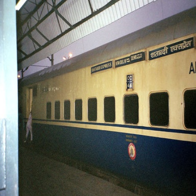
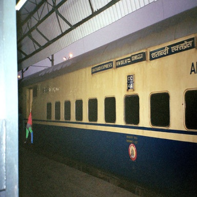
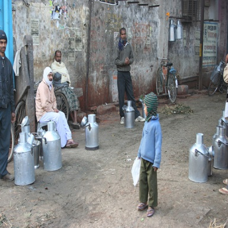
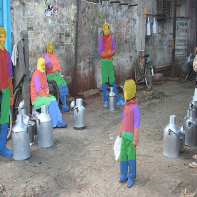
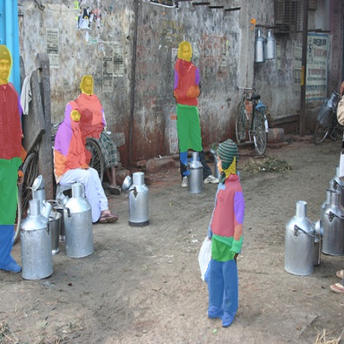
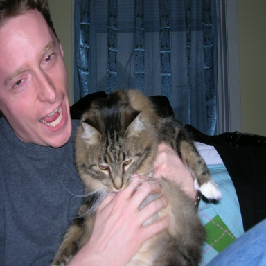
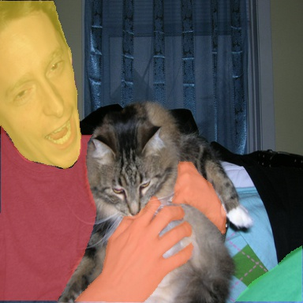
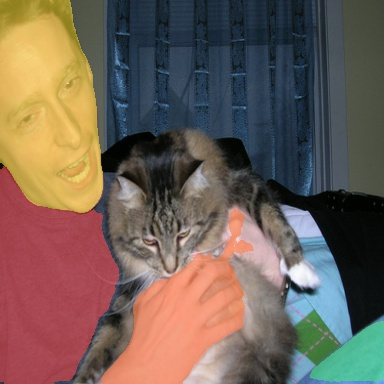

# Hierarchical Semantic Segmentation on Pascal-Part

This repository contains a hierarchical semantic segmentation pipeline for a prepared Pascal-Part subset with RGB images in `JPEGImages/` and segmentation masks in `gt_masks/*.npy`.


TODO:
 - add access to MLFlow logs
 - configure DVC and best weights downloading
 - Docker image with the best model inference
 - details report on segmentation approaches and losses

## Task Formulation

The task is to predict segmentation masks at three hierarchy levels for 7 label ids:

- `level 2`: `background`, `low_hand`, `torso`, `low_leg`, `head`, `up_leg`, `up_hand`
- `level 1`: `background`, `upper_body`, `lower_body`
- `level 0`: `background`, `body`

Hierarchy:

```text
background
body
├── upper_body: low_hand, torso, head, up_hand
└── lower_body: low_leg, up_leg
```

Primary evaluation metric:

- `mIoU^2`: mean IoU over the 6 fine classes, excluding background

Secondary checks:

- `mIoU^1`: mean IoU over `upper_body` and `lower_body`
- `mIoU^0`: IoU over `body`

## Repository Structure

```text
configs/                    experiment configs
scripts/                    train / evaluate / infer / analysis entrypoints
src/hseg/                   dataset, transforms, models, losses, metrics, trainer
reports/                    metrics registries and qualitative prediction artifacts
reports/readme_examples_segformer/
                            curated README qualitative examples
outputs/                    local training artifacts (ignored in git)
```

Core modules:

- `src/hseg/dataset.py`: dataset discovery, split handling, Pascal-Part dataset class
- `src/hseg/transforms.py`: resize, flip, class-aware crop, scale jitter, photometric distortion
- `src/hseg/model.py`: U-Net, DeepLabV3, LRASPP, DeepLabV3+, and SegFormer variants
- `src/hseg/losses.py`: hierarchical CE, consistency regularization, Dice, Lovasz, Tversky
- `src/hseg/metrics.py`: background-excluded `mIoU^0`, `mIoU^1`, `mIoU^2`
- `scripts/train.py`, `scripts/evaluate.py`, `scripts/infer.py`: main training and inference workflow

## Models Tested

The project compares several hierarchical architectures that share the same 3-head output API: `logits_l0`, `logits_l1`, `logits_l2`.

Common modeling choices across experiments:

- hierarchical cross-entropy on all three levels
- consistency regularization between fine predictions and coarse heads
- optional L2-focused auxiliary losses: Dice, Lovasz, or Tversky
- optional rare-part support via class-aware crop

Representative tested runs:

| Model | Approach / Backbone | Main Loss Setup | `mIoU^2` | `mIoU^1` | `mIoU^0` | `loss` |
|---|---|---|---:|---:|---:|---:|
| U-Net | baseline hierarchical encoder-decoder | CE(L0/L1/L2) + consistency | 0.2821 | 0.4322 | 0.6347 | 0.5900 |
| DeepLabV3 | torchvision MobileNetV3 fine-tuning | CE(L0/L1/L2) + consistency | 0.4551 | 0.6094 | 0.7730 | **0.3940** |
| LRASPP | torchvision MobileNetV3 fine-tuning | CE(L0/L1/L2) + consistency | 0.4331 | 0.5768 | 0.7448 | 0.4469 |
| DeepLabV3+ | SMP + timm MobileNetV3 | CE + consistency + Dice(L2) | 0.4955 | 0.6321 | 0.7844 | 0.4826 |
| DeepLabV3+ | SMP + timm MobileNetV3 + class-aware crop | CE + consistency + present-only Dice(L2) | 0.5097 | 0.6424 | 0.7912 | 0.4459 |
| SegFormer | SMP MiT-B1 + class-aware crop | CE + consistency + Lovasz(L2) + present-only Dice(L2) | **0.5784** | **0.6964** | 0.8262 | 0.4847 |
| SegFormer | SMP MiT-B1 + class-aware crop + scale jitter + photometric distortion | CE + bidirectional consistency + Lovasz(L2) + present-only Dice(L2) | 0.5704 | 0.6899 | **0.8296** | 0.4680 |

Notes:

- the best fine-grained result is the SegFormer MiT-B1 run with class-aware crop, Lovasz, and present-only Dice
- the augmentation + bidirectional-consistency SegFormer run improved `mIoU^0` but did not exceed the best `mIoU^2`

## Best Model

Best overall model by the primary metric `mIoU^2`:

- model: `SegFormer (SMP) + MiT-B1 + Class-Aware Crop + Lovasz + Present-Only Dice(L2)`
- artifact directory: `outputs/segformer_mitb1_lovasz_dice35_present_crop_wu4_lr6e4_pat6_bs14_acc2/`
- test metrics: `mIoU^2=0.5784`, `mIoU^1=0.6964`, `mIoU^0=0.8262`, `loss=0.4847`

## Qualitative Predictions

The repository keeps qualitative examples with original images, true-mask overlays, and predicted-mask overlays:

- curated README examples: `reports/readme_examples_segformer/`
- full per-run prediction folders: `reports/test_predictions_*/`
- artifact mapping registry: `reports/README.md`

Example panels from the best SegFormer run:

| Sample | Original | True Mask Overlay | Predicted Mask Overlay |
|---|---|---|---|
| `2008_000003` |  |  |  |
| `2008_000090` |  |  |  |
| `2008_000096` |  |  |  |
